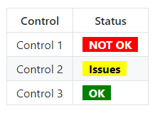

# nOutput HTTP_Status

This output will render a HTML page with two columns: control and status (based on available/selected warnings). The control is the title list of all or specific warnings and the status is a summary text given the corresponding warning current level.

Example of a HTML content:



## Example of use of the execArgs

````yaml
output:
  name       : Output HTTP Status
  chSubscribe: nattrmon::warnings
  execFrom   : nOutput_HTTP_Status
  execArgs   :
    # path          : /myConfig   # /myConfig/object.assets/noutputstatus
    # levelsIncluded:
    # - HIGH
    # - MEDIUM
    # - LOW
    # - INFO
    # redLevels     :
    # - HIGH
    # yellowLevels  :
    # - MEDIUM
    # greenLevels   :
    # - LOW
    # - INFO
    controls      :
    - App 1/.+
    - App 2/Status
    # redText       : NOT OK
    # yellowText    : Issues
    # greenText     : OK
    

````

## Description of execArgs

| execArgs   | Type   | Mandatory | Description |
|:-----------|:------:|:---------:|:------------|
| path       | String | No | A path to custom object.assets for noutputstatus (e.g. css, images, etc...) |
| levelsIncluded | Array | No | The warning levels to include on the status (defaults to ["HIGH", "MEDIUM", "LOW", "INFO]) |
| redLevels | Array | No | The warning levels that will be interpreted as a "red" level (defaults to [ "HIGH" ]) |
| yellowLevels | Array | No | The warning levels that will be interpreted as a "yellow" level (defaults to [ "MEDIUM" ]) |
| greenLevels | Array | No | The warning levels that will be interpreted as a "green" level (defaults to [ "LOW", "INFO" ]) |
| controls | Array | No | An array of regular expressions to select the warning titles that will be included in the status output (defaults to all) |
| redText | String | No | Customizes the text to use to described a "red" level (defaults to "NOT OK") |
| yellowText | String | No | Customizes the text to use to described a "yellow" level (defaults to "Issues" ) |
| greenText | String | No | Customizes the text to use to described a "green" level (defaults to "OK") |

## HTTP server

_tbc_

## HTTPS & Authentication

This HTTP plug supports, as other HTTP plugs, [basic or custom authentication](../..//guides/medium/output_https_withBasicAuth.html).